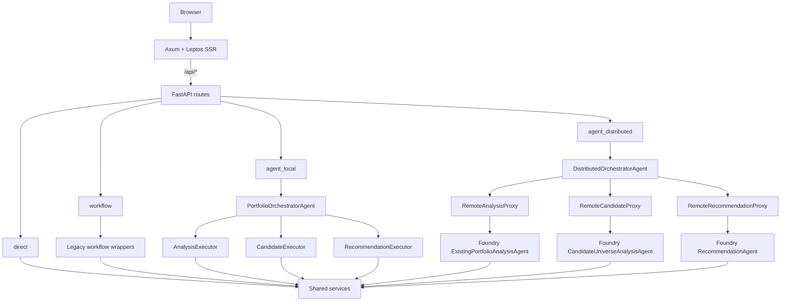
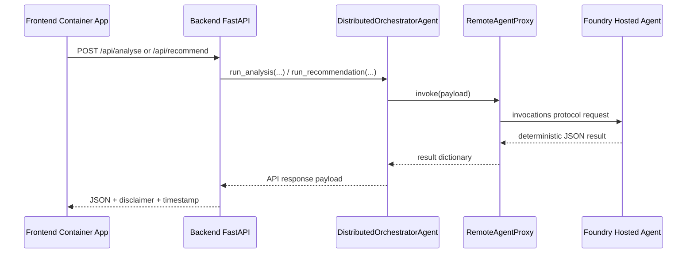
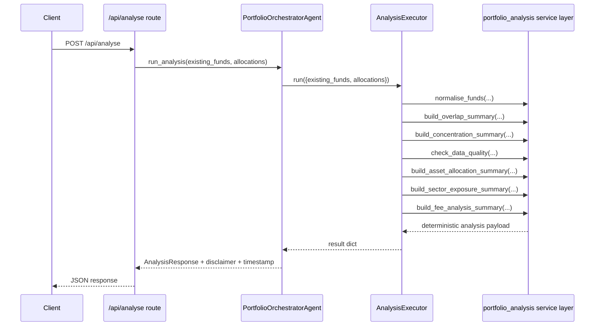
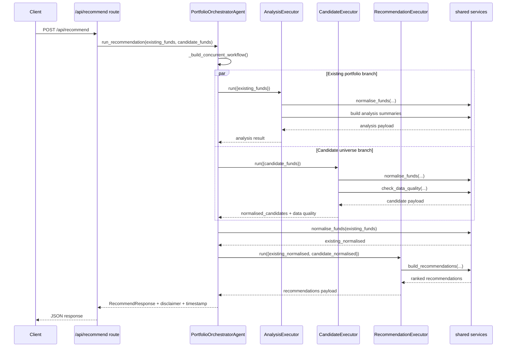
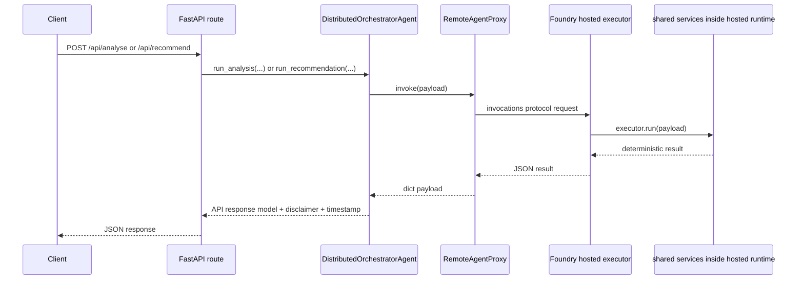

# Agent Orchestration Architecture
> For informational purposes only; not financial advice.
## 1. Overview
The backend now exposes one deterministic portfolio-analysis system through four execution modes: `direct`, `workflow`, `agent_local`, and `agent_distributed`. All four paths serve the same API contracts and are intended to produce the same business outputs because they all depend on the same shared service layer under `backend/src/services/`.
The orchestration system coordinates two product flows:
- **Portfolio analysis**: overlap, concentration, top overlaps, data quality, asset allocation, sector exposure, and fee analysis.
- **Recommendations**: candidate normalization, candidate data-quality evaluation, and deterministic ranking with score breakdowns.
The refactor documented here moved the project away from the older MAF Functional Workflow API based on `@workflow` and `@step`. That API still exists for backward compatibility in `backend/src/workflows/`, but the preferred architecture is now an explicit Orchestrator → Sub-Agent pattern built around concrete executors and orchestrators.
The main goals of the refactor were:
- make agent boundaries explicit in code
- separate orchestration from deterministic financial logic
- support both in-process and remote-hosted agent topologies
- keep one business-logic implementation across all modes
- make Foundry packaging and deployment more direct
In the new design, orchestration owns sequencing and transport, not business rules. Portfolio math stays deterministic. LLM usage is optional. The same disclaimer and timestamp requirements remain in force across every mode.
### 1.1 High-level architecture
```text
Browser
  │
  ▼
┌─────────────────────────────────────────────┐
│ Frontend (Axum + Leptos SSR)                │
│ - serves UI                                 │
│ - proxies /api/* to FastAPI                 │
└──────────────────────┬──────────────────────┘
                       │
                       ▼
┌─────────────────────────────────────────────┐
│ FastAPI routes                              │
│ - /api/analyse                              │
│ - /api/recommend                            │
└──────────────────────┬──────────────────────┘
                       │ dispatch by EXECUTION_MODE
      ┌────────────────┼─────────────────────┬──────────────────────┐
      ▼                ▼                     ▼                      ▼
  direct           workflow             agent_local         agent_distributed
      │                │                     │                      │
      ▼                ▼                     ▼                      ▼
 shared services   legacy MAF         local orchestrator      remote orchestrator
                                           │                      │
                                           ▼                      ▼
                              analysis / candidate / recommendation
                                  executors or remote proxies
```
### 1.2 Mermaid architecture diagram

## 2. Why the refactor happened
The original workflow-based implementation was useful, but it had three architectural drawbacks. First, the Functional Workflow API is explicitly experimental. Second, the old code expressed “agents” mostly as conceptual steps rather than concrete runtime units. Third, the earlier structure was less natural for hosting separate workers behind a remote invocations protocol.
The agent refactor addresses those drawbacks by introducing named runtime components that match the project specification:
- `PortfolioOrchestratorAgent`
- `ExistingPortfolioAnalysisAgent` via `AnalysisExecutor`
- `CandidateUniverseAnalysisAgent` via `CandidateExecutor`
- `RecommendationAgent` via `RecommendationExecutor`
This produces several practical improvements:
| Improvement | What changed |
| --- | --- |
| Explicit boundaries | Each responsibility now has a concrete class and payload contract |
| Local orchestration | `PortfolioOrchestratorAgent` coordinates in-process fan-out/fan-in |
| Remote packaging | Foundry assets can host one executor per runtime role |
| Shared logic reuse | Executors delegate to `src/services/`, so formulas remain single-source |
| Better migration story | `workflow` mode still exists while `agent_local` becomes the preferred path |
The workflow modules remain important, but they are now treated as a compatibility layer rather than the primary architecture.
## 3. Source map
| File | Purpose |
| --- | --- |
| `backend/src/agents/__init__.py` | Agent package marker |
| `backend/src/agents/executors.py` | Local executors and MAF executor compatibility helpers |
| `backend/src/agents/orchestrator.py` | In-process `PortfolioOrchestratorAgent` |
| `backend/src/agents/distributed.py` | `DistributedOrchestratorAgent` for remote routing |
| `backend/src/agents/remote.py` | Remote proxy abstractions |
| `backend/src/core/config.py` | `ExecutionMode` enum and environment-backed settings |
| `backend/src/services/portfolio_analysis.py` | Canonical analysis service layer |
| `backend/src/services/recommendation.py` | Canonical recommendation service layer |
| `backend/src/api/routes/analyse.py` | Four-way dispatch for analysis |
| `backend/src/api/routes/recommend.py` | Four-way dispatch for recommendations |
| `backend/src/workflows/analysis_workflow.py` | Legacy analysis workflow wrapper |
| `backend/src/workflows/recommendation_workflow.py` | Legacy recommendation workflow wrapper |
| `backend/foundry/Dockerfile` | Foundry runtime container image |
| `backend/foundry/entrypoint.py` | Role-based runtime entrypoint |
| `backend/foundry/agent-metadata.yaml` | Foundry agent metadata |
| `backend/foundry/deploy.sh` | Build, push, and deploy helper |
## 4. API dispatch model
Both primary FastAPI routes choose an execution path by reading `settings.execution_mode` from `backend/src/core/config.py`.
### 4.1 `/api/analyse`
`backend/src/api/routes/analyse.py` does the following:
1. validate `existing_funds`
2. read `settings.execution_mode`
3. if mode is `workflow`, call `execute_analysis_workflow(...)`
4. if that workflow fails, log a warning and fall back to `analyse_portfolio(...)`
5. if mode is `agent_local`, instantiate `PortfolioOrchestratorAgent`
6. if mode is `agent_distributed`, instantiate `DistributedOrchestratorAgent`
7. otherwise call `analyse_portfolio(...)`
### 4.2 `/api/recommend`
`backend/src/api/routes/recommend.py` mirrors that structure:
1. validate both `existing_funds` and `candidate_funds`
2. dispatch to workflow, local agent, distributed agent, or direct services
3. preserve the same request and response models in every mode
The API surface is intentionally mode-agnostic. Clients do not need to change payloads when the backend moves from direct execution to an orchestrated mode.
## 5. Shared executor contract
All local executors inherit from `_BasePortfolioExecutor` in `backend/src/agents/executors.py`.
### 5.1 What the base class provides
| Capability | Purpose |
| --- | --- |
| `id` / `name` | Stable executor identity |
| `run(input_data)` | Direct async execution for in-process use |
| `_build_agent_response(...)` | JSON serialization for MAF message responses |
| `handle_request(...)` | `@handler` entry point for MAF executor participation |
### 5.2 Optional MAF dependency behavior
The module uses a guarded import. If `agent-framework` is not available, it supplies fallback definitions for `Executor`, `handler`, `Message`, `AgentResponse`, `AgentExecutorRequest`, `AgentExecutorResponse`, and `WorkflowContext`. That keeps the file importable even when the orchestration library is absent.
### 5.3 Serialization behavior
The helper `_serialise_for_message(...)` converts executor output into JSON-friendly structures, including nested dictionaries, lists, Pydantic models, and lightweight objects with `__dict__`. This is what allows the same executor logic to work in direct local calls and in message-style orchestration wrappers.
## 6. Agent definitions
### 6.1 `AnalysisExecutor`
**Source:** `backend/src/agents/executors.py`  
**Runtime name:** `ExistingPortfolioAnalysisAgent`
**Role:** existing portfolio analysis wrapper around the shared analysis service layer.
**Input contract:**
```python
{
    "existing_funds": list[str],
    "allocations": list[float] | None,
}
```
**Output contract:**
```python
{
    "overlap_matrix": OverlapMatrix,
    "concentration": ConcentrationResult,
    "top_overlaps": list[OverlapPair],
    "data_quality": list[DataQualityEntry],
    "asset_allocation": AssetAllocationResult,
    "sector_exposure": SectorExposureResult,
    "fee_analysis": FeeAnalysisResult,
}
```
**Service functions called:**
- `normalise_funds(...)`
- `build_overlap_summary(...)`
- `build_concentration_summary(...)`
- `check_data_quality(...)`
- `build_asset_allocation_summary(...)`
- `build_sector_exposure_summary(...)`
- `build_fee_analysis_summary(...)`
**How it participates in orchestration:**
- the sole executor in local analysis mode
- the existing-portfolio branch in local recommendation fan-out
- the Foundry role selected by `AGENT_ROLE=analysis`
### 6.2 `CandidateExecutor`
**Source:** `backend/src/agents/executors.py`  
**Runtime name:** `CandidateUniverseAnalysisAgent`
**Role:** candidate-universe preparation wrapper.
**Input contract:**
```python
{
    "candidate_funds": list[str],
}
```
**Output contract:**
```python
{
    "normalised_candidates": list[NormalisedFund],
    "candidate_data_quality": list[DataQualityEntry],
}
```
**Service functions called:**
- `normalise_funds(...)`
- `check_data_quality(...)`
**How it participates in orchestration:**
- runs concurrently with `AnalysisExecutor` in local recommendation mode
- supplies `normalised_candidates` for the final scoring stage
- maps to `AGENT_ROLE=candidate` in Foundry
### 6.3 `RecommendationExecutor`
**Source:** `backend/src/agents/executors.py`  
**Runtime name:** `RecommendationAgent`
**Role:** deterministic candidate ranking.
**Input contract:**
```python
{
    "existing_normalised": list[NormalisedFund],
    "candidate_normalised": list[NormalisedFund],
}
```
**Output contract:**
```python
{
    "recommendations": dict[str, list[ScoredCandidate]],
}
```
**Service functions called:**
- `build_recommendations(...)`
**How it participates in orchestration:**
- always runs after preparation steps finish
- acts as the sequential fan-in stage after parallel branches complete
- maps to `AGENT_ROLE=recommendation` in Foundry
### 6.4 `PortfolioOrchestratorAgent`
**Source:** `backend/src/agents/orchestrator.py`
**Role:** local coordinator for in-process orchestration.
**Owned executors:**
- `AnalysisExecutor`
- `CandidateExecutor`
- `RecommendationExecutor`
**Response assembly responsibilities:**
- build `AnalysisResponse`
- build `RecommendResponse`
- append disclaimer and UTC timestamp
#### `run_analysis(existing_funds, allocations)`
This method calls `AnalysisExecutor.run(...)`, receives a deterministic dictionary, and wraps that output into `AnalysisResponse`. There is no parallel fan-out because analysis only needs the existing-portfolio branch.
#### `run_recommendation(existing_funds, candidate_funds)`
This is the main local orchestration path:
1. call `_build_concurrent_workflow()`
2. run `AnalysisExecutor` and `CandidateExecutor` concurrently with `asyncio.gather(...)`
3. normalize existing funds again with `normalise_funds(existing_funds)`
4. take `candidate_result["normalised_candidates"]`
5. call `RecommendationExecutor.run(...)`
6. wrap the result into `RecommendResponse`
#### `ConcurrentBuilder` note
`_build_concurrent_workflow()` attempts to construct `ConcurrentBuilder(participants=[self.analysis_executor, self.candidate_executor]).build()` when MAF orchestration APIs are installed. In the current implementation, actual concurrency still comes from `asyncio.gather(...)`. So `ConcurrentBuilder` is best understood as a topology declaration and compatibility hook rather than the sole scheduler.
#### Why existing funds are normalized again
The orchestrator does not reuse serialized analysis output for scoring. It calls `normalise_funds(existing_funds)` again so that recommendation scoring works with domain objects, not response-model formatting.
## 7. Distributed orchestration components
### 7.1 `DistributedOrchestratorAgent`
**Source:** `backend/src/agents/distributed.py`
**Role:** remote counterpart to `PortfolioOrchestratorAgent`.
**Owned proxies:**
- `RemoteAnalysisProxy`
- `RemoteCandidateProxy`
- `RemoteRecommendationProxy`
**Initialization rule:** requires `FOUNDRY_PROJECT_ENDPOINT`; otherwise raises `RuntimeError("FOUNDRY_PROJECT_ENDPOINT must be set for agent_distributed mode")`.
**Analysis path:**
```python
{
    "existing_funds": existing_funds,
    "allocations": allocations,
}
```
This payload is sent to `self.analysis_proxy.invoke(...)`, and the returned dictionary is wrapped into `AnalysisResponse`.
**Recommendation path:**
```python
{
    "existing_funds": existing_funds,
    "candidate_funds": candidate_funds,
}
```
This payload is sent to `self.recommendation_proxy.invoke(...)`, and the returned dictionary is wrapped into `RecommendResponse`.
### 7.2 `RemoteAgentProxy` and specializations
**Source:** `backend/src/agents/remote.py`
`RemoteAgentProxy` is the transport abstraction for hosted agents. The subclasses only bind names:
- `RemoteAnalysisProxy` → `ExistingPortfolioAnalysisAgent`
- `RemoteCandidateProxy` → `CandidateUniverseAnalysisAgent`
- `RemoteRecommendationProxy` → `RecommendationAgent`
**Important current-state note:** `RemoteAgentProxy.invoke(...)` raises `NotImplementedError` in this repository snapshot. That means distributed mode is wired into configuration and packaging, but it still needs a real invocation client before it becomes fully runnable end-to-end.
### 7.3 Foundry entrypoint
`backend/foundry/entrypoint.py` reads `AGENT_ROLE` and creates one executor per process.
| `AGENT_ROLE` | Executor |
| --- | --- |
| `analysis` | `AnalysisExecutor()` |
| `candidate` | `CandidateExecutor()` |
| `recommendation` | `RecommendationExecutor()` |
The file also supports local smoke testing by reading JSON from stdin and printing JSON to stdout.
## 8. Execution modes
### 8.1 Summary table
| Mode | Value | Primary path | When to use |
| --- | --- | --- | --- |
| Direct | `direct` | Route → shared service | simplest local execution |
| Workflow | `workflow` | Route → legacy MAF workflow → shared service | backward compatibility |
| Agent local | `agent_local` | Route → `PortfolioOrchestratorAgent` → local executors → services | preferred local implementation of the refactor |
| Agent distributed | `agent_distributed` | Route → `DistributedOrchestratorAgent` → remote proxies → Foundry executors | remote-hosted topology after transport is implemented |
### 8.2 `direct`
**How it works:** `/api/analyse` calls `analyse_portfolio(...)`; `/api/recommend` calls `recommend_candidates(...)`.
**When to use it:** default local development, deterministic debugging, simplest baseline behavior.
**Strengths:** fewest dependencies, easiest troubleshooting, no orchestration overhead.
### 8.3 `workflow`
**How it works:** routes call `execute_analysis_workflow(...)` or `execute_recommendation_workflow(...)` from the legacy workflow modules. If execution fails, the route logs a warning and falls back to direct mode.
**When to use it:** backward compatibility, validating the older MAF decorator model, regression coverage for the original design.
**Strengths:** keeps the original workflow path alive while the new agent pattern is adopted.
### 8.4 `agent_local`
**How it works:** routes instantiate `PortfolioOrchestratorAgent`. Analysis is a single-executor call. Recommendations fan out to analysis and candidate preparation, then fan in to recommendation scoring.
**When to use it:** preferred local development mode for the new architecture.
**Strengths:** explicit agent boundaries, no logic duplication, mirrors the target distributed topology.
**Important note:** `ConcurrentBuilder` is declared when available, but current execution still uses `asyncio.gather(...)` for concurrency.
### 8.5 `agent_distributed`
**How it works:** routes instantiate `DistributedOrchestratorAgent`, which delegates to remote proxies intended to call Foundry-hosted executors via the invocations protocol.
**When to use it:** remote-hosted deployment after implementing the transport adapter.
**Strengths:** deployable multi-agent topology, clear separation between orchestrator and workers, natural alignment with Foundry metadata.
**Current caveats:**
- `RemoteAgentProxy.invoke(...)` is still a stub here
- `RecommendationExecutor` expects normalized funds, while `DistributedOrchestratorAgent.run_recommendation(...)` currently sends raw symbols to the recommendation proxy
- until that contract gap is closed, `agent_local` is the safest practical orchestration mode
## 9. Configuration reference
Configuration is loaded in `backend/src/core/config.py`.
### 9.1 Environment variables
| Variable | Default | Required in which modes | Notes |
| --- | --- | --- | --- |
| `BACKEND_HOST` | `127.0.0.1` | all | FastAPI bind host |
| `BACKEND_PORT` | `8000` | all | FastAPI bind port |
| `LOG_LEVEL` | `INFO` | all | Logging level |
| `DATA_DIR` | `./data` | all | Reserved local data directory |
| `AUTH_ENABLED` | `false` | all | Reserved for future auth support |
| `CACHE_ENABLED` | `false` | all | Reserved for future caching support |
| `EXECUTION_MODE` | unset | all | explicit execution mode selector |
| `USE_WORKFLOWS` | `false` | legacy only | selects `workflow` when `EXECUTION_MODE` is unset |
| `FOUNDRY_PROJECT_ENDPOINT` | empty string | `agent_distributed` | required by `DistributedOrchestratorAgent` |
| `FOUNDRY_MODEL` | empty string | optional | read into settings but unused by current runtime files |
| `AGENT_ROLE` | `analysis` | Foundry runtime | selects hosted executor in `foundry/entrypoint.py` |
| `AZURE_CONTAINER_REGISTRY` | unset | deploy script | used by `backend/foundry/deploy.sh` |
| `IMAGE_TAG` | `latest` | deploy script | image tag for build/push |
### 9.2 `EXECUTION_MODE` values
```python
class ExecutionMode(str, Enum):
    DIRECT = "direct"
    WORKFLOW = "workflow"
    AGENT_LOCAL = "agent_local"
    AGENT_DISTRIBUTED = "agent_distributed"
```
Valid values are exactly:
- `direct`
- `workflow`
- `agent_local`
- `agent_distributed`
### 9.3 Precedence rules
The settings loader uses this order:
1. if `EXECUTION_MODE` is set, use it
2. otherwise if `USE_WORKFLOWS=true`, use `workflow`
3. otherwise default to `direct`
This precedence is covered in `backend/tests/test_workflows.py`.
### 9.4 Boolean parsing behavior
Boolean values are parsed by `_read_bool_env(...)`, which treats a variable as true only when the lowercased value equals `"true"`. Examples: `true` → true, `TRUE` → true, `1` → false, `yes` → false.
## 10. Local development guide
### 10.1 Install dependencies
```bash
cd backend
pip install -r requirements.txt
```
### 10.2 Direct mode (default)
```bash
cd backend
uvicorn src.api.main:app --reload
```
```bash
cd backend
EXECUTION_MODE=direct uvicorn src.api.main:app --reload
```
### 10.3 Workflow mode
```bash
cd backend
EXECUTION_MODE=workflow uvicorn src.api.main:app --reload
```
```bash
cd backend
USE_WORKFLOWS=true uvicorn src.api.main:app --reload
```
### 10.4 Agent local mode
```bash
cd backend
EXECUTION_MODE=agent_local uvicorn src.api.main:app --reload
```
### 10.5 Agent distributed mode
```bash
cd backend
EXECUTION_MODE=agent_distributed \
FOUNDRY_PROJECT_ENDPOINT=https://example.foundry.azure.com \
uvicorn src.api.main:app --reload
```
```bash
cd backend
EXECUTION_MODE=agent_distributed \
FOUNDRY_PROJECT_ENDPOINT=https://example.foundry.azure.com \
FOUNDRY_MODEL=gpt-4.1 \
uvicorn src.api.main:app --reload
```
Operational note: `RemoteAgentProxy.invoke(...)` is still a stub in this checkout, so `agent_local` is the practical local orchestration mode unless your environment supplies the missing transport implementation.
### 10.6 Example API calls
```bash
curl -X POST http://127.0.0.1:8000/api/analyse \
  -H 'Content-Type: application/json' \
  -d '{"existing_funds":["SPY","QQQ","VTI"],"allocations":[0.5,0.3,0.2]}'
```
```bash
curl -X POST http://127.0.0.1:8000/api/recommend \
  -H 'Content-Type: application/json' \
  -d '{"existing_funds":["SPY"],"candidate_funds":["ARKK","SCHD","VXUS"]}'
```
### 10.7 Local Foundry-entrypoint smoke tests
```bash
cd backend
AGENT_ROLE=analysis python -m foundry.entrypoint <<'JSON'
{"existing_funds": ["SPY", "QQQ"], "allocations": [0.6, 0.4]}
JSON
```
```bash
cd backend
AGENT_ROLE=candidate python -m foundry.entrypoint <<'JSON'
{"candidate_funds": ["ARKK", "SCHD", "VXUS"]}
JSON
```
```bash
cd backend
AGENT_ROLE=recommendation python -m foundry.entrypoint <<'JSON'
{"existing_normalised": [], "candidate_normalised": []}
JSON
```
## 11. Foundry deployment guide
### 11.1 Files under `backend/foundry/`
| File | Purpose |
| --- | --- |
| `Dockerfile` | packages the backend code and Foundry entrypoint |
| `entrypoint.py` | selects a single executor by `AGENT_ROLE` |
| `agent-metadata.yaml` | describes agents, protocol, and orchestrator metadata |
| `deploy.sh` | builds images, pushes them, and runs `azd deploy` |
### 11.2 What the Dockerfile does
`backend/foundry/Dockerfile`:
1. starts from `python:3.14-slim`
2. sets `WORKDIR /app`
3. copies `requirements.txt`
4. installs dependencies with `pip install --no-cache-dir -r requirements.txt`
5. copies `src/` and `foundry/`
6. sets `PYTHONPATH=/app`
7. exposes port `8080`
8. runs `python -m foundry.entrypoint`
Important detail: the Dockerfile does **not** bake a single agent role into the image. Role selection happens at runtime through `AGENT_ROLE`.
### 11.3 Building images
Using the helper script:
```bash
cd backend
./foundry/deploy.sh build
```
The script loops through these roles:
- `analysis`
- `candidate`
- `recommendation`
and builds these tags:
- `portfolio-analysis-agent:${IMAGE_TAG}`
- `portfolio-candidate-agent:${IMAGE_TAG}`
- `portfolio-recommendation-agent:${IMAGE_TAG}`
The script passes `--build-arg AGENT_ROLE=<role>` during `docker build`, but in the current Dockerfile role selection is still a runtime concern rather than a baked-in image distinction.
### 11.4 Pushing to ACR
```bash
cd backend
export AZURE_CONTAINER_REGISTRY=myregistry
export IMAGE_TAG=v0.1.0
./foundry/deploy.sh push
```
This pushes:
- `${AZURE_CONTAINER_REGISTRY}.azurecr.io/portfolio-analysis-agent:${IMAGE_TAG}`
- `${AZURE_CONTAINER_REGISTRY}.azurecr.io/portfolio-candidate-agent:${IMAGE_TAG}`
- `${AZURE_CONTAINER_REGISTRY}.azurecr.io/portfolio-recommendation-agent:${IMAGE_TAG}`
### 11.5 Deploying to Foundry Agent Service
```bash
cd backend
./foundry/deploy.sh deploy
```
That step currently runs:
```bash
azd deploy
```
All-in-one helper path:
```bash
cd backend
export AZURE_CONTAINER_REGISTRY=myregistry
export IMAGE_TAG=v0.1.0
./foundry/deploy.sh all
```
### 11.6 Agent metadata
`backend/foundry/agent-metadata.yaml` declares three sub-agents and one orchestrator.
| Agent | Role | Protocol | Description |
| --- | --- | --- | --- |
| `ExistingPortfolioAnalysisAgent` | `analysis` | `invocations` | existing-portfolio analysis |
| `CandidateUniverseAnalysisAgent` | `candidate` | `invocations` | candidate normalization and data quality |
| `RecommendationAgent` | `recommendation` | `invocations` | deterministic candidate ranking |
| `PortfolioOrchestratorAgent` | orchestrator | `agent_distributed` mode | coordinates the three sub-agents |
The metadata also includes an environment block setting:
- `EXECUTION_MODE: agent_distributed`
- `FOUNDRY_PROJECT_ENDPOINT: ${AZURE_AI_PROJECT_ENDPOINT}`
### 11.7 Hosted environment configuration
At minimum, configure:
```bash
EXECUTION_MODE=agent_distributed
FOUNDRY_PROJECT_ENDPOINT=<foundry-project-endpoint>
AGENT_ROLE=<analysis|candidate|recommendation>
```
Optional setting:
```bash
FOUNDRY_MODEL=<model-name>
```
### 11.8 Testing deployed agents
A practical validation order is:
1. test each hosted role independently
2. confirm invocations payload shapes for each role
3. verify the proxy implementation maps backend requests to those payloads
4. run end-to-end route tests through `agent_distributed`
Because `RemoteAgentProxy.invoke(...)` is still a stub in this snapshot, fully remote route testing requires an environment or branch that provides the actual invocation transport.

### 11.9 `azd up` hosted-agent layout and deployment path
The `backend/foundry/` helper assets described above are the manual packaging bridge already present in the repository, but the preferred Azure deployment path is the `azd up` topology documented in [Azure Deployment Guide — `azd up`](azd-deployment.md).

For the `azd` deployment shape, organize the hosted agents explicitly under an `agents/` folder so each runtime role has a dedicated manifest:

```text
agents/
├── analysis/
│   └── agent.yaml
├── candidate/
│   └── agent.yaml
└── recommendation/
    └── agent.yaml
```

That layout mirrors the runtime roles already defined in code:

- `AnalysisExecutor` / `ExistingPortfolioAnalysisAgent`
- `CandidateExecutor` / `CandidateUniverseAnalysisAgent`
- `RecommendationExecutor` / `RecommendationAgent`

A project-specific hosted-agent manifest should communicate five things clearly:

1. the deployed agent name
2. the role-specific startup contract
3. the `invocations` protocol
4. the runtime port expected by the hosted-agent surface
5. environment values such as `AGENT_ROLE`, `EXECUTION_MODE`, and `FOUNDRY_PROJECT_ENDPOINT`

A minimal project-oriented example, matching the current `agents/analysis/agent.yaml`, is:

```yaml
# yaml-language-server: $schema=https://raw.githubusercontent.com/microsoft/AgentSchema/refs/heads/main/schemas/v1.0/ContainerAgent.yaml
kind: hosted
name: analysis-agent
protocols:
  - protocol: invocations
    version: "1.0.0"
resources:
  cpu: "0.5"
  memory: 1Gi
environment_variables:
  - name: AGENT_ROLE
    value: analysis
tools: []
```

In the current `azure.yaml`, the service entry adds the runtime details around that manifest: `project: ./agents/analysis`, `host: azure.ai.agent`, `language: docker`, `docker.remoteBuild: true`, and `startupCommand: python main.py`. Equivalent candidate and recommendation manifests keep the same structure and change only the agent-specific identity and `AGENT_ROLE` value.

#### Invocations protocol in this repository
The distributed design here is not free-form conversational orchestration. It is request/response transport over deterministic JSON payloads.

Representative payload contracts are already visible in `backend/src/agents/executors.py`:

- analysis agent receives `{ "existing_funds": [...], "allocations": [...] }`
- candidate agent receives `{ "candidate_funds": [...] }`
- recommendation agent receives `{ "existing_normalised": [...], "candidate_normalised": [...] }`

The current recommendation hosted agent also accepts raw symbol lists and normalizes them internally before it calls `RecommendationExecutor`, which is useful during migration but should not be treated as an invitation to let contracts drift casually. The hosted-agent manifests and backend transport still need to preserve structured JSON inputs and outputs rather than human-oriented chat prompts.

#### How the backend talks to hosted agents in distributed mode
When the backend Container App is configured with:

```text
EXECUTION_MODE=agent_distributed
FOUNDRY_PROJECT_ENDPOINT=<project-endpoint>
```

`/api/analyse` and `/api/recommend` dispatch into `DistributedOrchestratorAgent`, which owns three remote proxies:

- `RemoteAnalysisProxy`
- `RemoteCandidateProxy`
- `RemoteRecommendationProxy`

The intended sequence is:

1. FastAPI route validates the HTTP payload
2. `DistributedOrchestratorAgent` selects the right remote proxy
3. the proxy sends a JSON invocation to the hosted agent registered in Foundry
4. the hosted agent runs the role-specific executor
5. the backend wraps the returned dictionary into the public API response model
6. the backend adds the disclaimer and timestamp before responding



For the complete `azd` environment setup, provisioning flow, deployment sequence, verification commands, and troubleshooting steps, use [Azure Deployment Guide — `azd up`](azd-deployment.md) as the source of truth.

## 12. Shared service layer
The service layer is the architectural anchor that prevents logic duplication.
### 12.1 `portfolio_analysis.py`
| Function | Role |
| --- | --- |
| `get_fund_inputs(symbols)` | resolve symbols into `FundInput` objects from stub data |
| `normalise_funds(symbols)` | build `NormalisedFund` objects |
| `check_data_quality(symbols)` | compute stale-data and holdings-count summaries |
| `build_overlap_summary(funds)` | produce `OverlapMatrix` and ranked `OverlapPair` values |
| `build_concentration_summary(funds, allocations)` | produce API-ready concentration output |
| `build_asset_allocation_summary(funds, allocations)` | produce API-ready asset allocation output |
| `build_sector_exposure_summary(funds, allocations)` | produce API-ready sector exposure output |
| `build_fee_analysis_summary(funds, allocations)` | produce API-ready fee output |
| `analyse_portfolio(existing_funds, allocations)` | canonical direct analysis pipeline |
### 12.2 `recommendation.py`
| Function | Role |
| --- | --- |
| `build_scored_candidates(existing, candidates)` | convert raw scoring output into API models |
| `build_recommendations(existing_funds, candidate_funds)` | build ranked candidates per existing fund |
| `recommend_candidates(existing_funds, candidate_funds)` | canonical direct recommendation pipeline |
### 12.3 Why this matters
All execution modes eventually rely on the same service functions. That means there is only one implementation of normalization, overlap math, concentration, stale-data detection, asset allocation, sector exposure, fee analysis, and scoring.
## 13. Testing
### 13.1 Running tests
From the backend directory:
```bash
python3 -m pytest tests/ -v
```
For orchestration-focused coverage only:
```bash
python3 -m pytest tests/test_workflows.py -v
```
### 13.2 Current orchestration test coverage
The repository currently uses function-based pytest tests rather than test classes for orchestration. The main orchestration coverage lives in `backend/tests/test_workflows.py`.
| Test function | Coverage |
| --- | --- |
| `test_analysis_pipeline_direct` | direct analysis pipeline matches deterministic helper output |
| `test_analysis_workflow_execution` | legacy analysis workflow execution works |
| `test_recommendation_pipeline_direct` | direct recommendation pipeline matches the scoring engine |
| `test_recommendation_workflow_execution` | legacy recommendation workflow execution works |
| `test_analyse_route_falls_back_when_workflow_fails` | `/api/analyse` falls back to direct mode on workflow failure |
| `test_recommend_route_falls_back_when_workflow_fails` | `/api/recommend` falls back to direct mode on workflow failure |
| `test_settings_default_execution_mode` | default mode is `direct` |
| `test_settings_execution_mode_uses_explicit_env` | explicit `EXECUTION_MODE` overrides `USE_WORKFLOWS` |
| `test_settings_execution_mode_uses_legacy_workflow_flag` | `USE_WORKFLOWS=true` selects `workflow` when explicit mode is absent |
### 13.3 What is not directly covered yet
There are currently no dedicated orchestration tests focused specifically on:
- executor `run(...)` methods
- `PortfolioOrchestratorAgent.run_recommendation(...)`
- `DistributedOrchestratorAgent`
- `RemoteAgentProxy`
- `foundry/entrypoint.py`
### 13.4 Mocking strategy for distributed mode
Distributed mode should be tested by mocking the proxy boundary rather than depending on live Foundry infrastructure.
Recommended monkeypatch targets:
- `RemoteAnalysisProxy.invoke`
- `RemoteCandidateProxy.invoke`
- `RemoteRecommendationProxy.invoke`
- or the shared `RemoteAgentProxy.invoke`
Typical strategy:
1. set `FOUNDRY_PROJECT_ENDPOINT` to any non-empty value
2. monkeypatch `invoke(...)` to return deterministic dictionaries
3. instantiate `DistributedOrchestratorAgent` or call the route
4. assert response model assembly, disclaimer, and timestamp
Illustrative example:
```python
import pytest
from src.agents.distributed import DistributedOrchestratorAgent

@pytest.mark.asyncio
async def test_distributed_analysis_with_mocked_proxy(monkeypatch):
    monkeypatch.setenv("FOUNDRY_PROJECT_ENDPOINT", "https://example.foundry")

    async def fake_invoke(self, payload):
        return {
            "overlap_matrix": {"funds": ["SPY"], "unweighted": [[1.0]], "weighted": [[1.0]]},
            "concentration": {"top_holdings": [], "total_tickers": 0, "top_10_weight": 0.0},
            "top_overlaps": [],
            "data_quality": [],
            "asset_allocation": {"portfolio": [], "per_fund": {}},
            "sector_exposure": {"portfolio": [], "per_fund": {}},
            "fee_analysis": {
                "per_fund": [],
                "portfolio_weighted_er": 0.0,
                "portfolio_weighted_er_pct": "0.0000%",
                "estimated_annual_cost_per_10k": 0.0,
            },
        }

    monkeypatch.setattr("src.agents.remote.RemoteAgentProxy.invoke", fake_invoke)

    orchestrator = DistributedOrchestratorAgent()
    response = await orchestrator.run_analysis(["SPY"])

    assert response.disclaimer
    assert response.timestamp
```
## 14. Sequence diagrams
### 14.1 `agent_local` analysis flow

### 14.2 `agent_local` recommendation flow with concurrent fan-out

### 14.3 `agent_distributed` flow

## 15. Current-state guidance
The most complete and directly runnable paths in this checkout are `direct`, `workflow`, and `agent_local`. The distributed path already has configuration support, route dispatch, Foundry packaging, metadata, and an entrypoint, but it still needs a real proxy transport and final contract alignment for the recommendation path. For maintainers, the key rule is simple: keep business logic in `src/services/`, keep executors thin and deterministic, keep proxies transport-focused, keep routes mode-agnostic, and preserve the disclaimer in every response.
