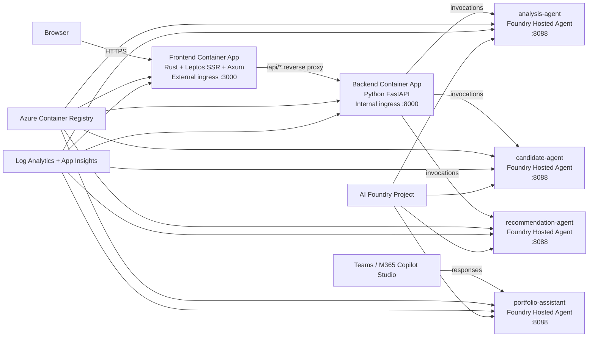

# Azure Deployment Guide — `azd up`
> For informational purposes only; not financial advice.
## 1. Overview
This guide documents the Azure deployment shape for this repository when it is deployed with the Azure Developer CLI (`azd`) and the Microsoft Foundry hosted-agent extension. The target runtime model is consistent with the rest of the codebase: the frontend remains the only public web endpoint, the backend remains an internal API, and three hosted agents provide the distributed execution roles for analysis, candidate preparation, and recommendation ranking.
The intended deployment uses these building blocks:
- Azure Container Apps for the **frontend** and **backend-api** services
- Microsoft Foundry Hosted Agents for **analysis-agent**, **candidate-agent**, and **recommendation-agent**
- Azure Container Registry (ACR) for container images
- Log Analytics and Application Insights for telemetry
- AI Foundry account/project resources for agent hosting and invocation
- Bicep infrastructure in `infra/`
`azd up` is the operator's shortest path because it combines infrastructure provisioning and workload deployment. In this project, that means creating or updating the resource group, Container Apps environment, observability stack, registry, Foundry resources, app deployments, and hosted-agent registrations.
The repository already contains the distributed-mode configuration surface (`EXECUTION_MODE=agent_distributed`, `FOUNDRY_PROJECT_ENDPOINT`, `backend/src/agents/distributed.py`, `backend/src/agents/remote.py`, and `backend/foundry/*`). This guide describes the target `azd` deployment shape that should stay aligned with those runtime contracts.
## 2. Architecture
### 2.1 Deployment diagram

### 2.2 Deployed services
| Service | Host | Port | Protocol | Ingress |
|---|---|---:|---|---|
| `frontend` | Azure Container Apps | `3000` | HTTP | External |
| `backend-api` | Azure Container Apps | `8000` | HTTP | Internal |
| `analysis-agent` | Microsoft Foundry Agent Service | `8088` | Invocations | N/A |
| `candidate-agent` | Microsoft Foundry Agent Service | `8088` | Invocations | N/A |
| `recommendation-agent` | Microsoft Foundry Agent Service | `8088` | Invocations | N/A |
| `portfolio-assistant` | Microsoft Foundry Agent Service | `8088` | Responses | N/A |
### 2.3 Request flow
1. Browser requests the frontend URL.
2. Frontend renders SSR pages and accepts user submissions.
3. Frontend proxies `/api/*` to the backend internal URL.
4. Backend validates payloads and routes work to distributed mode.
5. Backend invokes Foundry hosted agents via the project endpoint.
6. Backend converts agent results into public API response models.
7. Frontend renders the final output with disclaimer, timestamps, and score breakdowns.
### 2.4 Expected repo layout
```text
portfolio-analysis/
├── azure.yaml                # azd project definition
├── infra/                    # Bicep templates and parameters
├── frontend/                 # Rust / Leptos / Axum app
├── backend/                  # Python / FastAPI backend
├── agents/                   # Hosted-agent manifests
│   ├── analysis/
│   ├── candidate/
│   ├── recommendation/
│   └── portfolio-assistant/  # Conversational agent (Responses protocol)
└── .azure/                   # azd environment state (generated)
```
If your checkout differs slightly, keep the same deployment rules: frontend public, backend internal, hosted agents remote, and configuration sourced from environment variables rather than hard-coded values. In the current `azure.yaml`, `frontend` and `backend-api` use `host: containerapp`, while the four agent services use `host: azure.ai.agent` with `startupCommand: python main.py`.
## 3. Prerequisites
### 3.1 Azure permissions
You need an active Azure subscription, permission to create or update resources, and the right tenant access for AI Foundry hosted agents. In practice, **Owner** or **Contributor** is sufficient for most deployments, and **User Access Administrator** is required if the Bicep templates create managed identities or role assignments.
### 3.2 Required tools
| Tool | Minimum version | Why it is needed |
|---|---|---|
| Azure Developer CLI (`azd`) | `1.24.0` | project initialization, provisioning, deployment, environment management |
| `azure.ai.agents` azd extension | `0.1.31-preview` | hosted-agent commands and deployment support |
| Azure CLI (`az`) | current stable | subscription selection, diagnostics, Container Apps inspection |
| Rust | stable | local frontend validation |
| `python3.14` | `3.14` | local backend validation and smoke tests |

> **Note:** Docker/Podman is **not required**. All services use `remoteBuild: true`, meaning container images are built in Azure (ACR Tasks for agents, Container Apps Build for apps). No local container runtime is needed.
### 3.3 Install and verify the toolchain
Install or update `azd`, then verify it:
```bash
azd version
azd upgrade
```
Install the hosted-agent extension and confirm it is present:
```bash
azd ext install azure.ai.agents
azd ext list
```
Sign in with both CLIs:
```bash
az login
azd auth login
```
Confirm the active subscription:
```bash
az account show --output table
```
If you work across subscriptions, set the target one explicitly:
```bash
az account set --subscription <subscription-id-or-name>
az account show --output table
```
### 3.4 Foundry readiness checks
Before deployment, confirm that the target Azure region supports the required Container Apps and Foundry resources, that your tenant allows AI Foundry project creation and hosted-agent deployment, and that the branch you are using contains the expected `azure.yaml`, `infra/`, and `agents/` assets.
## 4. Quick Start
Use this when you want the shortest path from clone to deployment.
```bash
# 1. Clone and navigate
git clone https://github.com/<your-org>/portfolio-analysis.git
cd portfolio-analysis
git checkout feature/agent-orchestration
# 2. Install azd agent extension (if not already)
azd ext install azure.ai.agents
# 3. Initialize environment
azd init
# 4. Deploy everything
azd up
```
For repeat deployments into an existing environment, the common pattern is:
```bash
az login
azd auth login
azd env select <environment-name>
azd up
```
## 5. Step-by-step deployment
### 5.1 Authenticate and confirm context
```bash
az login
azd auth login
az account show --output table
azd env list
```
Before going further, verify the active tenant, subscription, branch, and environment selection. It is very easy to deploy the right code into the wrong environment if you skip this check.
### 5.2 Initialize the project
If this is the first time the repo has been used with `azd` on your machine, run:
```bash
azd init
```
If `azure.yaml` already exists and the project is recognized, you can go straight to environment creation or selection.
### 5.3 Create or select an environment
Create a new environment:
```bash
azd env new portfolio-dev
```
Select an existing environment:
```bash
azd env select portfolio-dev
```
Reasonable naming patterns include `portfolio-dev`, `portfolio-test`, `portfolio-stage`, and `portfolio-prod`.
### 5.4 Set environment inputs
Set the values that operators should own directly.
#### Azure and naming inputs
```bash
azd env set AZURE_SUBSCRIPTION_ID <subscription-id>
azd env set AZURE_LOCATION <azure-region>
azd env set AZURE_RESOURCE_GROUP rg-<environment-name>
azd env set AZURE_AI_ACCOUNT_NAME <ai-account-name>
azd env set AZURE_AI_PROJECT_NAME <foundry-project-name>
azd env set AZURE_PRINCIPAL_ID <principal-id>
azd env set AZURE_PRINCIPAL_TYPE User
azd env set AZURE_TENANT_ID <tenant-id>
```
> **Important:** `AZURE_TENANT_ID` is required by the `azure.ai.agents` extension's postdeploy hook. Set it from your current login: `azd env set AZURE_TENANT_ID "$(az account show --query tenantId -o tsv)"`
#### Frontend runtime inputs
```bash
azd env set FRONTEND_HOST 0.0.0.0
azd env set FRONTEND_PORT 3000
```
#### Backend runtime inputs
```bash
azd env set BACKEND_HOST 0.0.0.0
azd env set BACKEND_PORT 8000
azd env set LOG_LEVEL INFO
azd env set DATA_DIR /app/data
azd env set AUTH_ENABLED false
azd env set CACHE_ENABLED false
azd env set EXECUTION_MODE agent_distributed
```
#### Optional or deployment-specific inputs
```bash
azd env set AI_PROJECT_DEPLOYMENTS '[]'
azd env set AI_PROJECT_CONNECTIONS '[]'
azd env set AI_PROJECT_CONNECTION_CREDENTIALS ''
azd env set AI_PROJECT_DEPENDENT_RESOURCES '[]'
azd env set ENABLE_HOSTED_AGENTS true
azd env set ENABLE_CAPABILITY_HOST true
azd env set ENABLE_MONITORING true
azd env set USE_EXISTING_AI_PROJECT false
azd env set FOUNDRY_MODEL <model-name-if-used>
```
#### Portfolio Assistant inputs (required for portfolio-assistant agent)
The portfolio-assistant agent uses the Responses protocol and requires an LLM model deployment. This must be set **before** running `azd up`, otherwise the agent container will crash at startup.
```bash
# Required — set to the name of a model deployment in your Foundry project.
# Check available deployments with:
#   az cognitiveservices account deployment list \
#     --name <ai-account-name> --resource-group <rg> --output table
azd env set AZURE_AI_MODEL_DEPLOYMENT_NAME <model-deployment-name>
```
> **Important:** If `AZURE_AI_MODEL_DEPLOYMENT_NAME` is not set, the portfolio-assistant container will fail with: `OSError: AZURE_AI_MODEL_DEPLOYMENT_NAME environment variable is not set`. The three Invocations agents (analysis, candidate, recommendation) do not require this variable — they are deterministic and do not use an LLM.

The value is substituted into `agents/portfolio-assistant/agent.yaml` at deploy time via `${AZURE_AI_MODEL_DEPLOYMENT_NAME}` and injected into the container by the Foundry platform at runtime.
### 5.5 Review the environment file before provisioning
```bash
azd env get-values
```
Review these especially carefully:
- `AZURE_LOCATION`
- `AZURE_SUBSCRIPTION_ID`
- `FRONTEND_PORT`
- `BACKEND_PORT`
- `EXECUTION_MODE`
- `AZURE_AI_MODEL_DEPLOYMENT_NAME` — **required for portfolio-assistant**, must match a deployed model
- globally unique names such as the ACR name

#### Complete environment variable reference

The table below lists every azd environment variable used by this project, grouped by who sets it and when.

**User-set before `azd up` (required):**

| Variable | Example | Used by |
|----------|---------|---------|
| `AZURE_SUBSCRIPTION_ID` | `xxxxxxxx-xxxx-xxxx-xxxx-xxxxxxxxxxxx` | Bicep (subscription targeting) |
| `AZURE_LOCATION` | `eastus2` | Bicep (resource location) |
| `AZURE_RESOURCE_GROUP` | `rg-my-project` | Bicep (resource group name) |
| `AZURE_AI_ACCOUNT_NAME` | `my-ai-account` | Bicep (AI Foundry account) |
| `AZURE_AI_PROJECT_NAME` | `my-ai-project` | Bicep (Foundry project) |
| `AZURE_PRINCIPAL_ID` | `<your-object-id>` | Bicep (RBAC assignments) |
| `AZURE_PRINCIPAL_TYPE` | `User` | Bicep (RBAC principal type) |
| `AZURE_TENANT_ID` | `<your-tenant-id>` | azd ai agents extension |

**User-set before `azd up` (required for portfolio-assistant):**

| Variable | Example | Used by |
|----------|---------|---------|
| `AZURE_AI_MODEL_DEPLOYMENT_NAME` | `gpt-4.1-mini` | `agents/portfolio-assistant/agent.yaml` → container env var |

**User-set before `azd up` (optional):**

| Variable | Default | Used by |
|----------|---------|---------|
| `FRONTEND_HOST` | `0.0.0.0` | Frontend container |
| `FRONTEND_PORT` | `3000` | Frontend container |
| `BACKEND_HOST` | `0.0.0.0` | Backend container |
| `BACKEND_PORT` | `8000` | Backend container |
| `LOG_LEVEL` | `INFO` | Backend + agent containers |
| `DATA_DIR` | `/app/data` | Backend container |
| `AUTH_ENABLED` | `false` | Backend container |
| `CACHE_ENABLED` | `false` | Backend container |
| `EXECUTION_MODE` | `agent_distributed` | Backend (agent routing) |
| `ENABLE_HOSTED_AGENTS` | `true` | Bicep (Foundry agent hosting) |
| `ENABLE_CAPABILITY_HOST` | `true` | Bicep (Foundry capability host) |
| `ENABLE_MONITORING` | `true` | Bicep (Log Analytics + App Insights) |
| `USE_EXISTING_AI_PROJECT` | `false` | Bicep (reuse existing project) |

**Auto-set by azd/platform (do NOT set manually):**

| Variable | Set by | Description |
|----------|--------|-------------|
| `FOUNDRY_PROJECT_ENDPOINT` | Foundry platform | Injected into agent containers at runtime |
| `FOUNDRY_AGENT_NAME` | Foundry platform | Agent name injected at runtime |
| `APPLICATIONINSIGHTS_CONNECTION_STRING` | Foundry platform | Telemetry connection string |
| `FRONTEND_URI` | azd (post-provision) | Deployed frontend URL |
| `BACKEND_URI` | azd (post-provision) | Deployed backend URL |
| `AZURE_AI_PROJECT_ENDPOINT` | azd (post-provision) | Foundry project endpoint |
| `AZURE_CONTAINER_REGISTRY_ENDPOINT` | azd (post-provision) | ACR login server |
| `SERVICE_*_IMAGE_NAME` | azd (post-deploy) | Built container image tags |
| `AGENT_*_ENDPOINT` | azd ai agents ext | Agent version endpoints |
| `AGENT_*_VERSION` | azd ai agents ext | Agent version numbers |
### 5.6 Provision infrastructure
Provisioning is the control-plane step. Run it explicitly if you want to separate infra creation from app deployment:
```bash
azd provision
```
Expected outcomes:
- resource group created or updated
- ACR created or attached
- Log Analytics workspace created
- Application Insights created
- Container Apps environment created
- frontend and backend Container App resources created
- Foundry account/hub and Foundry project created or referenced
- deployment outputs written back into the environment
After provisioning, inspect the resolved values again:
```bash
azd env get-values
```
You usually expect to see output-style values such as `AZURE_RESOURCE_GROUP`, `AZURE_CONTAINER_REGISTRY_ENDPOINT`, `AZURE_AI_PROJECT_ENDPOINT`, `FRONTEND_URI`, `BACKEND_URI`, and the backend runtime value sourced from the Foundry project endpoint.
### 5.7 Deploy the workloads
Deploy the application and hosted-agent layer:
```bash
azd deploy
```
For `frontend` and `backend-api`, deployment normally means build → tag → push → new revision → environment injection. For the hosted agents, deployment normally means read manifests → package runtime → register or update the agent in Foundry → publish the agent version.
### 5.8 Use the one-command path
If you do not need separate provisioning and deployment phases, run:
```bash
azd up
```
Use `azd up` when you want the simplest dev/test experience or when infra and application changes should be reconciled together.
### 5.9 Save the key outputs
After a successful deployment, record at least `FRONTEND_URI`, `BACKEND_URI`, `AZURE_AI_PROJECT_ENDPOINT`, `AZURE_RESOURCE_GROUP`, and the names and active versions of all three hosted agents.
Useful commands:
```bash
azd env get-values
az containerapp list --resource-group <resource-group> --output table
azd ai agent show
```
## 6. Resource inventory
| Resource | Purpose | Notes |
|---|---|---|
| Resource group | environment boundary | usually one per azd environment |
| Azure Container Registry | shared image registry | stores app and agent images |
| Log Analytics workspace | centralized logs | shared by Container Apps and agents |
| Application Insights | telemetry | requests, traces, dependencies, failures |
| Azure Container Apps environment | shared runtime boundary | hosts frontend and backend |
| Frontend Container App | public UI | external ingress on `3000` |
| Backend Container App | internal API | internal ingress on `8000` |
| AI Foundry account/hub | AI control plane | created or referenced by IaC |
| AI Foundry project | hosted-agent target | provides the project endpoint |
| Hosted agent: analysis | remote portfolio analysis | invoked by the backend |
| Hosted agent: candidate | candidate-universe evaluation | invoked by the backend |
| Hosted agent: recommendation | deterministic ranking | invoked by the backend |
The backend stays internal because this is intentionally a single-origin system. The browser should not know or need the backend origin, and that keeps the app boundary simple. The agents are separated from the backend container because the codebase already models explicit runtime roles for analysis, candidate preparation, and ranking.
## 7. Environment variables reference
The table below consolidates the Azure, IaC, app-runtime, hosted-agent, and output variables currently referenced by `azure.yaml`, `infra/main.parameters.json`, `infra/main.bicep`, and the runtime code.
| Variable | Required | Default | Description |
|---|---|---|---|
| `AZURE_ENV_NAME` | Yes | set by `azd env new` | Name of the azd environment |
| `AZURE_LOCATION` | Yes | none | Azure region used for provisioning |
| `AZURE_SUBSCRIPTION_ID` | Yes | active CLI subscription | Subscription targeted by the deployment |
| `AZURE_TENANT_ID` | Yes | none | Azure AD tenant ID; required by the `azure.ai.agents` extension postdeploy hook |
| `AZURE_RESOURCE_GROUP` | Yes | `rg-<environment>` in IaC | Resource group name passed into `main.bicep` |
| `AZURE_PRINCIPAL_ID` | Yes | none | Principal used for project-scoped role assignment in the Foundry project |
| `AZURE_PRINCIPAL_TYPE` | Yes | none | Principal type for that role assignment, for example `User` or `ServicePrincipal` |
| `AZURE_AI_ACCOUNT_NAME` | Yes | derived by IaC when omitted | AI Foundry account name (`aiFoundryResourceName`) |
| `AZURE_AI_PROJECT_NAME` | Yes | `ai-project-${AZURE_ENV_NAME}` in IaC | AI Foundry project name |
| `AI_PROJECT_DEPLOYMENTS` | No | `[]` | JSON array of model deployments to create under the AI account |
| `AI_PROJECT_CONNECTIONS` | No | `[]` | JSON array of extra project connections |
| `AI_PROJECT_CONNECTION_CREDENTIALS` | No | empty string | Secure JSON for connection credentials |
| `AI_PROJECT_DEPENDENT_RESOURCES` | No | `[]` | JSON array of dependent resources tracked with the project |
| `ENABLE_HOSTED_AGENTS` | No | `true` | Enables hosted-agent resources and related wiring |
| `ENABLE_CAPABILITY_HOST` | No | `true` | Enables the `capabilityHosts/agents` resource |
| `ENABLE_MONITORING` | No | `true` | Creates or wires Application Insights and Log Analytics |
| `USE_EXISTING_AI_PROJECT` | No | `false` | Reuses an existing AI account/project instead of creating one |
| `SERVICE_BACKEND_API_IMAGE_NAME` | Deploy output | empty string | Image name injected by `azd deploy` for the backend Container App |
| `SERVICE_FRONTEND_IMAGE_NAME` | Deploy output | empty string | Image name injected by `azd deploy` for the frontend Container App |
| `AZURE_CONTAINER_REGISTRY_RESOURCE_ID` | Optional | empty string | Existing ACR resource ID if reusing a shared registry |
| `AZURE_CONTAINER_REGISTRY_ENDPOINT` | Output or optional input | empty string | Existing or provisioned ACR login server |
| `AZURE_AI_PROJECT_ACR_CONNECTION_NAME` | Output or optional input | empty string | Foundry project connection name for ACR |
| `APPLICATIONINSIGHTS_CONNECTION_STRING` | Output or optional input | empty string | Application Insights connection string |
| `APPLICATIONINSIGHTS_RESOURCE_ID` | Output or optional input | empty string | Application Insights resource ID |
| `APPLICATIONINSIGHTS_CONNECTION_NAME` | Output or optional input | empty string | Foundry project connection name for Application Insights |
| `FRONTEND_HOST` | Yes | `127.0.0.1` locally | Frontend bind host; use `0.0.0.0` in containers |
| `FRONTEND_PORT` | Yes | `3000` | Frontend container port |
| `BACKEND_BASE_URL` | Yes | `http://127.0.0.1:8000` locally | URL the frontend uses to proxy to the backend; in Azure it is populated from the backend FQDN |
| `BACKEND_HOST` | Yes | `127.0.0.1` locally | Backend bind host; use `0.0.0.0` in containers |
| `BACKEND_PORT` | Yes | `8000` | Backend container port |
| `LOG_LEVEL` | No | `INFO` | Logging verbosity for backend and hosted-agent runtimes |
| `DATA_DIR` | No | `./data` | Backend data directory |
| `AUTH_ENABLED` | No | `false` | Reserved auth flag |
| `CACHE_ENABLED` | No | `false` | Reserved caching flag |
| `EXECUTION_MODE` | Yes for this topology | `direct` | Must be `agent_distributed` for hosted-agent routing |
| `USE_WORKFLOWS` | No | `false` | Legacy compatibility flag |
| `FOUNDRY_PROJECT_ENDPOINT` | Yes in distributed mode | empty string | Backend runtime endpoint used by `DistributedOrchestratorAgent`; Bicep sets it from `AZURE_AI_PROJECT_ENDPOINT` |
| `FOUNDRY_MODEL` | Optional | empty string | Optional model binding if your manifests or runtime consume it |
| `SERVICE_ROLE` | Yes inside each hosted agent | manifest-specific | Selects `analysis`, `candidate`, or `recommendation` |
| `FOUNDRY_AGENT_NAME` | Hosted runtime | managed by platform | Name of the running hosted agent |
| `FOUNDRY_AGENT_VERSION` | Hosted runtime | managed by platform | Active hosted-agent version |
| `FOUNDRY_AGENT_SESSION_ID` | Hosted runtime | managed by platform | Request/session identifier |
| `AZURE_CONTAINER_REGISTRY` | Output | derived by IaC | Name of the provisioned ACR |
| `AZURE_CONTAINER_REGISTRY_NAME` | Output | derived by IaC | Alias output for the ACR name |
| `AZURE_AI_ACCOUNT_ID` | Output | none | Resource ID of the AI Foundry account |
| `AZURE_AI_PROJECT_ID` | Output | none | Resource ID of the AI Foundry project |
| `AZURE_AI_FOUNDRY_PROJECT_ID` | Output | none | Alias output for the Foundry project ID |
| `AZURE_AI_PROJECT_ENDPOINT` | Output | none | Primary Foundry project endpoint |
| `AI_FOUNDRY_PROJECT_ENDPOINT` | Output | none | Alias output for the Foundry project endpoint |
| `AZURE_OPENAI_ENDPOINT` | Output | none | OpenAI endpoint exposed by the AI account |
| `BACKEND_URI` | Output | none | Internal backend Container App URI |
| `FRONTEND_URI` | Output | none | Public frontend Container App URI |
Recommended cloud runtime values remain:
```text
FRONTEND_HOST=0.0.0.0
FRONTEND_PORT=3000
BACKEND_HOST=0.0.0.0
BACKEND_PORT=8000
LOG_LEVEL=INFO
DATA_DIR=/app/data
AUTH_ENABLED=false
CACHE_ENABLED=false
EXECUTION_MODE=agent_distributed
```
## 8. Hosted agents in the azd deployment
### 8.1 Recommended `agents/` layout
```text
agents/
├── analysis/
│   ├── agent.yaml
│   ├── Dockerfile
│   └── main.py
├── candidate/
│   ├── agent.yaml
│   ├── Dockerfile
│   └── main.py
└── recommendation/
    ├── agent.yaml
    ├── Dockerfile
    └── main.py
```
Each hosted agent needs a clear name, role, protocol, and startup contract even if the underlying code is shared.
### 8.2 Role mapping to this codebase
| Hosted agent | Azure service path | Code boundary | Responsibility |
|---|---|---|---|
| `analysis-agent` | `project: ./agents/analysis`, `host: azure.ai.agent` | `AnalysisExecutor` / `ExistingPortfolioAnalysisAgent` | overlap, concentration, allocation, sector, fee, and quality analysis |
| `candidate-agent` | `project: ./agents/candidate`, `host: azure.ai.agent` | `CandidateExecutor` / `CandidateUniverseAnalysisAgent` | candidate normalization and candidate data-quality work |
| `recommendation-agent` | `project: ./agents/recommendation`, `host: azure.ai.agent` | `RecommendationExecutor` / `RecommendationAgent` | deterministic ranking and score packaging |
### 8.3 Example hosted-agent manifest
The preview schema can evolve, but the project-specific manifest should always communicate the agent identity, description, invocation protocol, target port, and runtime environment values.
```yaml
# yaml-language-server: $schema=https://raw.githubusercontent.com/microsoft/AgentSchema/refs/heads/main/schemas/v1.0/ContainerAgent.yaml
kind: hosted
name: analysis-agent
protocols:
  - protocol: invocations
    version: "1.0.0"
resources:
  cpu: "0.5"
  memory: 1Gi
environment_variables:
  - name: SERVICE_ROLE
    value: analysis
tools: []
```
The service-level `startupCommand` currently comes from `azure.yaml` (`python main.py`), the container image comes from `agents/analysis/Dockerfile`, and the app itself is served by `InvocationAgentServerHost` on port `8088`. Equivalent candidate and recommendation manifests keep the same shape and change only the `name` and `SERVICE_ROLE` values.

> **Note:** The `AGENT_*` and `FOUNDRY_*` environment variable prefixes are reserved by the Foundry platform. Use `SERVICE_ROLE` (not `AGENT_ROLE`) for custom variables.
### 8.4 Invocations payload shape
This architecture uses deterministic JSON payloads rather than free-form chat prompts.
Analysis payload:
```json
{
  "existing_funds": ["SPY", "QQQ"],
  "allocations": [0.6, 0.4]
}
```
Candidate payload:
```json
{
  "candidate_funds": ["ARKK", "SCHD", "VXUS"]
}
```
Recommendation payload:
```json
{
  "existing_normalised": [],
  "candidate_normalised": []
}
```
The current recommendation hosted agent is slightly more forgiving than the raw executor contract: `agents/recommendation/main.py` also accepts `{ "existing_funds": [...], "candidate_funds": [...] }` and normalizes those symbols internally before calling `RecommendationExecutor`. The practical rule is still the same: keep the backend proxy payloads and the hosted-agent manifests aligned around structured JSON contracts.
### 8.5 Backend-to-agent path in distributed mode
The backend Container App should receive at least:
```text
EXECUTION_MODE=agent_distributed
FOUNDRY_PROJECT_ENDPOINT=<project-endpoint>
```
The runtime sequence is:
1. FastAPI route validates the public request.
2. `DistributedOrchestratorAgent` selects the correct proxy.
3. The proxy sends a JSON invocation to the hosted agent.
4. The hosted agent runs the role-specific executor.
5. The backend wraps the dictionary result in the public API model.
6. The backend adds disclaimer and timestamp before responding.
## 9. Verify the deployment
Verification should happen at four layers: infra, Container Apps, hosted agents, and end-to-end user flows.
### 9.1 Verify resource creation
```bash
az group show --name <resource-group>
az containerapp env list --resource-group <resource-group> --output table
az acr list --resource-group <resource-group> --output table
az monitor app-insights component show --app <app-insights-name> --resource-group <resource-group>
```
### 9.2 Verify the Container Apps
List the apps:
```bash
az containerapp list --resource-group <resource-group> --output table
```
Inspect the frontend:
```bash
az containerapp show --name <frontend-container-app-name> --resource-group <resource-group> --output yaml
```
Inspect the backend:
```bash
az containerapp show --name <backend-container-app-name> --resource-group <resource-group> --output yaml
```
Confirm external ingress on the frontend, internal ingress on the backend, target ports `3000` and `8000`, expected images, and expected environment values.
### 9.3 Verify the hosted agents
```bash
azd ai agent show
```
Confirm that all three agents are present, the newest version is active, startup succeeded, and environment values such as `SERVICE_ROLE` and project endpoint are correct.
### 9.4 Test the public frontend endpoint
```bash
curl -I https://<frontend-endpoint>
```
Expected result: an HTTP success status from the frontend Container App.
### 9.5 Test the supported health-check path
Because the backend is internal-only, the preferred external smoke test is still the frontend origin:
```bash
curl https://<frontend-endpoint>/api/health
```
Expected result: HTTP `200`, JSON body with `status: "ok"`, and a timestamp.
### 9.6 Test backend health on the internal path
From a connected VNet, a Container Apps exec session, or another internal test context, you can also verify the backend directly:
```bash
curl https://<backend>/api/health
```
With the recommended internal ingress, do **not** expect that URL to work from the public internet.
### 9.7 Smoke-test the analyse flow
```bash
curl -X POST https://<frontend-endpoint>/api/analyse \
  -H 'Content-Type: application/json' \
  -d '{"existing_funds":["SPY","QQQ","VTI"],"allocations":[0.5,0.3,0.2]}'
```
### 9.8 Smoke-test the recommendation flow
```bash
curl -X POST https://<frontend-endpoint>/api/recommend \
  -H 'Content-Type: application/json' \
  -d '{"existing_funds":["SPY"],"candidate_funds":["ARKK","SCHD","VXUS"]}'
```
A successful result should include the disclaimer, timestamp, and explanation or score breakdown.
## 10. Local development with azd
### 10.1 Test agents locally
```bash
azd ai agent run
azd ai agent invoke --local '{"existing_funds": ["SPY", "QQQ"]}'
```
Preview command surfaces can change, so check `azd ai agent invoke --help` if flags differ in your installed extension version.
### 10.2 Test the backend locally
```bash
cd backend
python3.14 -m pip install -r requirements.txt
export BACKEND_HOST=127.0.0.1
export BACKEND_PORT=8000
export LOG_LEVEL=INFO
export DATA_DIR=./data
python3.14 -m uvicorn src.api.main:app --host "$BACKEND_HOST" --port "$BACKEND_PORT" --reload
```
### 10.3 Test the frontend locally
```bash
cd frontend
export FRONTEND_HOST=127.0.0.1
export FRONTEND_PORT=3000
export BACKEND_BASE_URL=http://127.0.0.1:8000
cargo run
```
### 10.4 Local distributed-mode smoke test
If you are validating distributed mode locally, set:
```bash
export EXECUTION_MODE=agent_distributed
export FOUNDRY_PROJECT_ENDPOINT=https://<your-foundry-project-endpoint>
```
Then call:
```bash
curl -X POST http://127.0.0.1:8000/api/analyse \
  -H 'Content-Type: application/json' \
  -d '{"existing_funds":["SPY","QQQ"]}'
```
### 10.5 Mixed local/cloud validation pattern
A practical rollout pattern is: run frontend locally, run backend locally, test hosted agents locally with `azd ai agent run`, deploy a dev environment with `azd up`, and rerun the same smoke tests against the Azure frontend URL. That sequence usually isolates whether a problem belongs to app code, container build, infrastructure, agent packaging, or runtime networking.
## 11. Monitoring and troubleshooting
### 11.1 Hosted-agent status
```bash
azd ai agent show
```
Use this first when a hosted agent version is missing, unhealthy, or inactive.
### 11.2 Hosted-agent logs
```bash
azd ai agent monitor
```
Use this when a hosted agent fails to start, when invocations return server errors, or when you need to confirm environment values or startup behavior.
### 11.3 Container App logs
Frontend logs:
```bash
az containerapp logs show --name <frontend-container-app-name> --resource-group <resource-group> --follow
```
Backend logs:
```bash
az containerapp logs show --name <backend-container-app-name> --resource-group <resource-group> --follow
```
### 11.4 Revision state
Frontend revisions:
```bash
az containerapp revision list --name <frontend-container-app-name> --resource-group <resource-group> --output table
```
Backend revisions:
```bash
az containerapp revision list --name <backend-container-app-name> --resource-group <resource-group> --output table
```
This is the fastest way to confirm whether traffic is still pinned to an older revision after a deploy.
### 11.5 Common issues and fixes
| Symptom | Likely cause | What to check | Typical fix |
|---|---|---|---|
| `azd up` fails before deployment starts | missing login or wrong subscription | `az account show`, `azd auth login` | sign in again and set the correct subscription |
| provisioning fails around Foundry | unsupported region or insufficient permissions | region, RBAC, tenant policy | switch region or request the required permissions |
| frontend works but `/api/*` fails | wrong `BACKEND_BASE_URL` | frontend env vars, backend internal URL | update the env wiring and redeploy frontend |
| backend starts but distributed mode fails | missing `FOUNDRY_PROJECT_ENDPOINT` | backend env vars | set it from provisioning outputs |
| hosted agent is not reachable | manifest or version issue | `azd ai agent show`, `azd ai agent monitor` | fix the manifest and redeploy the agent |
| image pull fails | ACR auth or wrong tag | Container App events, agent status | verify tags, image names, and registry permissions |
| agent build fails with 404 BlobNotFound | `docker.context` not set in azure.yaml | agent Dockerfiles need repo root as context | add `context: ../..` and `path: ./Dockerfile` in azure.yaml |
| Docker Hub rate limit (`toomanyrequests`) | unauthenticated pulls during ACR Tasks | base image FROM lines | switch to `public.ecr.aws/docker/library/` mirrors |
| postdeploy fails with `AZURE_TENANT_ID not set` | missing env var for agents extension | `azd env get-values` | run `azd env set AZURE_TENANT_ID "$(az account show --query tenantId -o tsv)"` |
| Rust build fails with `rustc X.Y is not supported` | base image Rust version too old for deps | Dockerfile FROM tag | add `RUN rustup update stable && rustup default stable` before `cargo build` |
| startup fails with a port error | manifest and runtime port disagree | target port, container config | align the manifest and runtime port |
| direct browser call to backend fails | backend is internal by design | ingress settings | use the frontend origin or an internal test path |
### 11.6 Practical debugging order
When something fails, check the environment values first, then hosted-agent status, then Container App state, then backend logs, then hosted-agent logs, and finally rerun the smoke tests. That order usually separates configuration failures from runtime failures fastest.
## 12. Cleanup
Remove the entire environment with:
```bash
azd down
```
Use this for developer environments, preview environments, and temporary test environments. Before running it, confirm you do not need to retain Log Analytics history, Application Insights traces, ACR images, hosted-agent versions, or shared Foundry resources referenced by another environment.
After cleanup, a quick validation is:
```bash
az group show --name <resource-group>
```
If the command returns not found, cleanup is complete.
## 13. Cost considerations
Exact pricing depends on region, SKU, preview terms, replica counts, telemetry volume, and agent usage. Do not treat the notes below as a bill estimate; use the Azure Pricing Calculator and your actual resource settings for precise numbers.
| Resource | Cost pattern | Main billing driver | Practical note |
|---|---|---|---|
| Azure Container Apps environment | low to moderate baseline | environment runtime and support infra | shared by frontend and backend |
| Frontend Container App | low to moderate | vCPU, memory, requests, replicas | usually lighter than the backend |
| Backend Container App | moderate | vCPU, memory, request volume, orchestration load | can grow with API traffic |
| Hosted agents | usage-based | runtime activity, invocations, model usage | usually the most variable part |
| Azure Container Registry | low to moderate | image storage and egress | grows with image history |
| Log Analytics | usage-based | ingestion and retention volume | verbose logs can get expensive |
| Application Insights | usage-based | telemetry volume and retention | sampling matters |
| AI Foundry project resources | variable | project features and model usage | validate region-specific pricing |
Cost-control tips:
- keep dev environments small and delete them with `azd down` when idle
- avoid excessive debug logging in app and agent runtimes
- keep image retention under control in ACR
- use conservative replica settings in non-production environments
## 14. Deployment checklist
### 14.1 Before deployment
- `az login` completed
- `azd auth login` completed
- correct subscription selected
- `azd` is at least `1.24.0`
- `azure.ai.agents` is at least `0.1.31-preview`
- `AZURE_TENANT_ID` is set in the azd environment
- environment values reviewed with `azd env get-values`
- `EXECUTION_MODE=agent_distributed`
### 14.2 After provisioning
- resource group exists
- ACR exists
- Container Apps environment exists
- Log Analytics exists
- Application Insights exists
- Foundry project exists
- `FOUNDRY_PROJECT_ENDPOINT` is available
### 14.3 After deployment
- frontend revision is healthy
- backend revision is healthy
- all three hosted agents appear in `azd ai agent show`
- `https://<frontend>/api/health` returns `ok`
- `/api/analyse` and `/api/recommend` smoke tests succeed
- responses include the disclaimer and timestamp
## 15. Related documentation
- [Documentation index](index.md)
- [Backend architecture](backend.md)
- [Frontend architecture](frontend.md)
- [Agent orchestration architecture](agent-orchestration.md)
For the Foundry-specific orchestration details and the `agents/` layout, also see the section added to `Documentation/agent-orchestration.md`.
