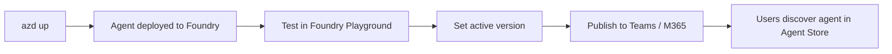
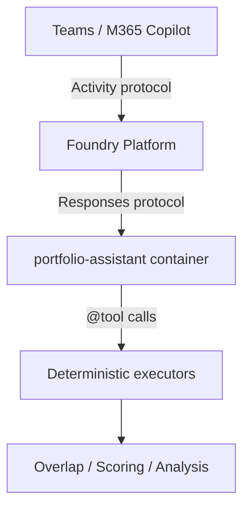

# Publishing Portfolio-Assistant to Teams & Microsoft 365 Copilot

> For informational purposes only; not financial advice.

## Overview

After deploying the `portfolio-assistant` agent with `azd up`, you can publish it to **Microsoft Teams** and **Microsoft 365 Copilot** so that users can interact with it directly from those surfaces. Publishing uses the Foundry portal — the agent's stable endpoint is published, allowing you to roll out new versions without republishing.



> **Important:** Publishing agents to Microsoft 365 Copilot and Microsoft Teams is currently in **Early Access Preview** and subject to [Supplemental Terms of Use for Microsoft Azure Previews](https://azure.microsoft.com/support/legal/preview-supplemental-terms/).

---

## Prerequisites

Before publishing, ensure the following:

### 1. Agent is deployed and healthy

```bash
# Confirm agent is running
azd env get-values | grep AGENT_PORTFOLIO_ASSISTANT

# Test the agent responds correctly
TOKEN=$(az account get-access-token --resource https://ai.azure.com --query accessToken -o tsv)
ENDPOINT=$(azd env get-values | grep AZURE_AI_PROJECT_ENDPOINT | cut -d'=' -f2 | tr -d '"')

curl -sS -X POST "${ENDPOINT}/agents/portfolio-assistant/endpoint/protocols/openai/v1/responses" \
  -H "Authorization: Bearer $TOKEN" \
  -H "Content-Type: application/json" \
  -d '{"input": "Analyse SPY and QQQ", "stream": false}' | jq .status
```

### 2. Required RBAC role assignments

| Role | Scope | Purpose |
|------|-------|---------|
| **Azure AI User** | Foundry project | Create, manage, and publish agents |
| **Azure Bot Service Contributor** | Resource group | Create the Azure Bot Service resource during publishing |

Assign roles via CLI if needed:

```bash
# Get your user object ID
USER_OID=$(az ad signed-in-user show --query id -o tsv)

# Assign Azure AI User on the project
az role assignment create \
  --assignee $USER_OID \
  --role "Azure AI User" \
  --scope "/subscriptions/<sub-id>/resourceGroups/<rg>/providers/Microsoft.CognitiveServices/accounts/<ai-account>"

# Assign Bot Service Contributor on the resource group
az role assignment create \
  --assignee $USER_OID \
  --role "Azure Bot Service Contributor" \
  --scope "/subscriptions/<sub-id>/resourceGroups/<rg>"
```

### 3. Register the `Microsoft.BotService` resource provider

The publishing process creates an Azure Bot Service resource. The provider must be registered:

```bash
az provider register --namespace Microsoft.BotService

# Check registration status
az provider show --namespace Microsoft.BotService --query registrationState -o tsv
```

### 4. Agent protocol compatibility

The portfolio-assistant uses the **Responses protocol**, which is required for Teams/M365 publishing. The three Invocations-based agents (analysis, candidate, recommendation) are **not publishable** to Teams/M365 — they serve as backend processing agents only.

| Agent | Protocol | Teams/M365 Publishable |
|-------|----------|----------------------|
| `portfolio-assistant` | Responses | ✅ Yes |
| `analysis-agent` | Invocations | ❌ No |
| `candidate-agent` | Invocations | ❌ No |
| `recommendation-agent` | Invocations | ❌ No |

---

## Step 1: Test your agent thoroughly

Before publishing, confirm the agent responds correctly in the Foundry Playground:

1. Open the [Microsoft Foundry portal](https://ai.azure.com)
2. Navigate to your project (e.g. `my-ai-project`)
3. Select **Agents** → **portfolio-assistant**
4. Use the built-in chat to test:
   - "Analyse my portfolio with SPY, QQQ, and VTI"
   - "Evaluate ARKK and SCHD as candidates against my portfolio"
   - "Recommend switch candidates for SPY"
5. Verify:
   - ✅ Disclaimer is present ("For informational purposes only; not financial advice.")
   - ✅ Data quality information is shown
   - ✅ Score breakdowns are included
   - ✅ No financial advice or directive language

See [Testing Deployed Agents](testing-deployed-agents.md) for detailed testing guidance.

---

## Step 2: Select the active agent version

1. In the Foundry portal, select the `portfolio-assistant` agent
2. Click **Publish** (top bar)
3. In the publish dropdown, select the arrow icon next to **Active version**
4. Choose one of:
   - **Always use latest** (default) — new versions auto-serve to Teams/M365
   - **Specific version** — pin to a version number (e.g., version 1)

> **Recommendation:** Use "Always use latest" during development, pin to a specific version for production.

---

## Step 3: Publish to Teams and Microsoft 365

1. In the Foundry portal, select **Publish** → **Publish to Teams and Microsoft 365 Copilot**
2. An Azure Bot Service resource is automatically created (or shown as read-only if one exists)
3. Complete the required metadata:

| Field | Value for this project |
|-------|----------------------|
| **Name** | Portfolio Analysis Assistant |
| **Publish version** | `1.0.0` |
| **Short description** | Analyse fund portfolio overlap, concentration, and switch candidates |
| **Description** | A conversational agent that analyses ETF and mutual fund portfolios for holdings overlap, asset allocation, sector exposure, and recommends potential switch candidates with explainable scoring. For informational purposes only; not financial advice. |
| **Developer** | Your name or organization |

Optional metadata (expand **More**):

| Field | Description |
|-------|-------------|
| **Developer website** | Your organization URL (HTTPS) |
| **Terms of use** | URL to terms of use (HTTPS) |
| **Privacy statement** | URL to privacy policy (HTTPS) |

> ⚠️ **Do not include** secrets, API keys, or sensitive information in metadata fields — these are visible to users.

4. Select **Next: Publish options**

---

## Step 4: Choose publishing scope

### Option A: Direct publish — "Just you"

| Aspect | Detail |
|--------|--------|
| Availability | Immediate — no admin approval required |
| Visibility | Under **Your agents** in the Agent Store |
| Sharing | Send the agent link to specific users |
| Best for | Personal testing, small teams, pilots |

Steps:
1. Select **Direct publish** tab
2. Under **Choose who can use this agent**, select **Just you**
3. Click **Publish**
4. ✅ Agent is immediately available under **Your agents** in the Microsoft 365 Agent Store

### Option B: Direct publish — "People in your organization"

| Aspect | Detail |
|--------|--------|
| Availability | After admin approval |
| Visibility | Under **Built by your org** in the Agent Store |
| Access control | Microsoft 365 app policies in your tenant |
| Best for | Organization-wide distribution, production |

Steps:
1. Select **Direct publish** tab
2. Under **Choose who can use this agent**, select **People in your organization**
3. Click **Publish**
4. A Microsoft 365 admin must review and approve in the [Microsoft 365 admin center](https://admin.cloud.microsoft/?#/agents/all/requested)
5. Once approved, the agent appears under **Built by your org** for all tenant users

### Option C: Download and customize

For advanced customization of the agent manifest before distributing:

1. Select **Download & customize** tab
2. Click **Download ZIP** — a `.zip` with the agent manifest downloads
3. Customize the manifest as needed
4. In Microsoft Teams: **Apps** → **Manage your apps** → **Upload an app**
5. Select **Upload a custom app** or **Submit an app to your org** and upload the `.zip`

---

## Step 5: Verify in Teams / M365 Copilot

After publishing:

### In Microsoft Teams
1. Open Teams → **Apps** → Search for "Portfolio Analysis Assistant"
2. Add the agent to a chat
3. Send: "Analyse my portfolio with SPY, QQQ, and VTI"
4. Confirm response includes disclaimer and analysis data

### In Microsoft 365 Copilot
1. Open Microsoft 365 Copilot
2. Navigate to the Agent Store
3. Find the agent under **Your agents** (individual scope) or **Built by your org** (org scope)
4. Start a conversation

---

## Updating a published agent

### Update the agent logic (new version)

When you deploy a new version with `azd up` or `azd deploy portfolio-assistant`:
- If **"Always use latest"** is selected — the new version is automatically served
- If **pinned to a specific version** — update the active version in the publish dropdown

No need to republish to M365/Teams — the stable endpoint remains the same.

### Update display metadata

To change the name, description, or other metadata visible in Teams/M365:

1. In Foundry portal → **Publish** dropdown
2. Select **Update agent Teams and Microsoft 365 Copilot display properties**
3. Edit the fields
4. Save — version auto-increments if not manually set

---

## How it works: Protocol layers



| Layer | Protocol | Managed by |
|-------|----------|-----------|
| User ↔ Teams/M365 | Activity | Foundry platform (automatic) |
| Platform ↔ Agent | Responses | Your agent code (`ResponsesHostServer`) |
| Agent ↔ Tools | Function calls | Agent Framework (`@tool` decorators) |

You only implement the **Responses protocol** layer. The Activity protocol for Teams channel integration is handled entirely by the Foundry platform.

---

## Limitations

| Limitation | Description |
|------------|-------------|
| File uploads in M365 | File uploads and image generation don't work for agents published to Microsoft 365 (they work in Teams) |
| Private Link | Not supported for Teams or Azure Bot Service integrations |
| Streaming | Published agents don't support streaming responses or citations |
| CSV/JSON upload | Users must provide fund symbols as text, not file uploads, when interacting via Teams/M365 |

### Impact on portfolio-assistant

Since file upload is not available in M365, the agent's input method when published is limited to:
- Typing fund symbols directly (e.g., "Analyse SPY, QQQ, and VTI")
- Pasting holdings data as text

The web frontend continues to support all input methods including CSV/JSON upload.

---

## Troubleshooting

| Issue | Cause | Resolution |
|-------|-------|-----------|
| Error publishing the agent | Invalid metadata or version | Ensure the agent has a unique identity. Confirm developer name ≤ 32 characters. |
| Azure Bot Service creation fails | Missing permissions or unregistered provider | Register `Microsoft.BotService`. Assign **Azure Bot Service Contributor** role. |
| `403 AuthorizationFailed` for `Microsoft.BotService/botServices/write` | Identity lacks permission | Assign **Azure Bot Service Contributor** on the resource group. |
| Organization-scope agent doesn't appear | Admin approval pending | Check [M365 admin center](https://admin.cloud.microsoft/?#/agents/all/requested). Confirm app policies. |
| Agent works in Foundry but fails after publishing | Agent identity missing permissions | Assign RBAC roles to the agent's identity for any Azure resources it accesses. |
| Publishing fails with identity error | Agent doesn't have a unique identity | See the [migration guide](https://learn.microsoft.com/azure/foundry/agents/how-to/migrate-agent-applications). |
| Users can't find the agent | Wrong scope or approval pending | For individual scope, share the direct link. For org scope, confirm admin approval. |
| Agent crashes after publishing | `AZURE_AI_MODEL_DEPLOYMENT_NAME` not set | Set the env var and redeploy: `azd env set AZURE_AI_MODEL_DEPLOYMENT_NAME <model> && azd deploy portfolio-assistant` |

---

## Safety considerations for published agents

When the portfolio-assistant is published to Teams/M365, it becomes accessible to a wider audience. The agent enforces the following safety rules via system instructions:

1. **Mandatory disclaimer** — Every response includes "For informational purposes only; not financial advice."
2. **No directive language** — Never says "buy", "sell", or "switch to"
3. **No fabricated data** — Only presents data from deterministic tool outputs
4. **Data quality transparency** — Always shows data timestamps and quality indicators
5. **Explainable scoring** — All recommendations include component score breakdowns

These rules are enforced at the agent level (in `agents/portfolio-assistant/main.py` system instructions) and cannot be overridden by user prompts.

---

## Quick reference

```bash
# 1. Deploy the agent
azd env set AZURE_AI_MODEL_DEPLOYMENT_NAME gpt-4.1-mini
azd up

# 2. Verify it's running
TOKEN=$(az account get-access-token --resource https://ai.azure.com --query accessToken -o tsv)
ENDPOINT=$(azd env get-values | grep AZURE_AI_PROJECT_ENDPOINT | cut -d'=' -f2 | tr -d '"')
curl -sS -X POST "${ENDPOINT}/agents/portfolio-assistant/endpoint/protocols/openai/v1/responses" \
  -H "Authorization: Bearer $TOKEN" \
  -H "Content-Type: application/json" \
  -d '{"input": "Health check", "stream": false}' | jq .status

# 3. Register Bot Service provider
az provider register --namespace Microsoft.BotService

# 4. Publish via Foundry portal
# Navigate to: ai.azure.com → Project → Agents → portfolio-assistant → Publish
```

---

## Further reading

- [Publish agents to Microsoft 365 Copilot and Microsoft Teams (Microsoft Learn)](https://learn.microsoft.com/azure/foundry/agents/how-to/publish-copilot)
- [Role-based access control in the Foundry portal](https://learn.microsoft.com/azure/foundry/concepts/rbac-foundry)
- [Publish and share agents — Foundry docs](https://learn.microsoft.com/azure/foundry/agents/how-to/configure-agent)
- [Portfolio Assistant Agent](portfolio-assistant.md) — architecture and tools reference
- [Testing Deployed Agents](testing-deployed-agents.md) — pre-publish verification
- [Azure Deployment Guide](azd-deployment.md) — full `azd up` workflow
