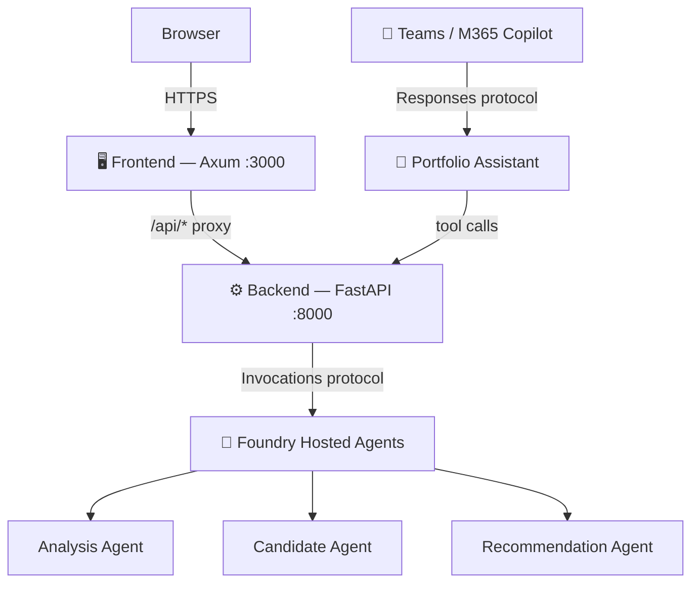
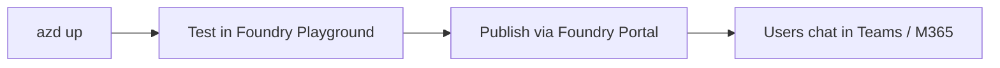

# 📊 Portfolio Overlap & Fund Switch Candidate Analyzer

> ⚠️ **For informational purposes only; not financial advice.**

Analyze mutual fund and ETF portfolio overlap, compute concentration metrics, and discover switch candidates — all with explainable, deterministic scoring.

Inspired by tools like Morningstar's Portfolio X-Ray, this app measures holdings overlap, asset allocation, sector exposure, fees, and recommends alternatives with transparent 0–100 scores.

---

## ✨ Features

| Feature | Description |
|---------|-------------|
| 🔍 **Overlap Analysis** | Unweighted & weighted overlap matrices across fund pairs |
| 📈 **Concentration Metrics** | Portfolio-level concentration by holdings weight |
| 🏗️ **Asset Allocation** | Equity/bond/cash breakdown per fund and portfolio |
| 🌐 **Sector Exposure** | Technology, healthcare, financials, etc. per fund |
| 💰 **Fee Comparison** | Expense ratio analysis across your holdings |
| 🎯 **Switch Candidates** | Ranked alternatives (0–100) with score breakdowns |
| 🤖 **Conversational AI** | Natural language interface via Teams / M365 Copilot |
| 🛡️ **Safety by Design** | Mandatory disclaimers, no financial advice, no fabricated data |

---

## 🏗️ Architecture



**Single-origin design** — the browser only talks to the frontend. All `/api/*` requests are reverse-proxied to the backend. The portfolio-assistant provides a conversational interface for Teams/M365.

---

## 🚀 Quickstart

### Prerequisites

| Tool | Version | Purpose |
|------|---------|---------|
| [Azure subscription](https://azure.microsoft.com/pricing/purchase-options/azure-account) | — | Contributor access required |
| [`azd`](https://learn.microsoft.com/azure/developer/azure-developer-cli/install-azd) | ≥ 1.24.0 | Azure Developer CLI |
| [`az`](https://learn.microsoft.com/cli/azure/install-azure-cli) | Latest | Azure CLI |
| [Python](https://www.python.org/downloads/) | ≥ 3.11 | Backend runtime (tested with 3.14) |
| [Rust](https://rustup.rs/) | Stable | Frontend build toolchain |

### 1️⃣ Clone & install

```bash
git clone https://github.com/<your-org>/portfolio-analysis.git
cd portfolio-analysis/backend
pip install -r requirements.txt
```

### 2️⃣ Run locally

**Terminal 1 — Backend:**
```bash
cd backend
python3 -m uvicorn src.api.main:app --host 127.0.0.1 --port 8000 --reload
```

**Terminal 2 — Frontend:**
```bash
cd frontend
export BACKEND_BASE_URL=http://127.0.0.1:8000
cargo run
```

🌐 Open http://127.0.0.1:3000

### 3️⃣ Verify

```bash
# Health check
curl http://127.0.0.1:3000/api/health

# Analyse portfolio overlap
curl -X POST http://127.0.0.1:3000/api/analyse \
  -H "Content-Type: application/json" \
  -d '{"existing_funds": ["SPY", "QQQ", "VTI"]}'

# Score switch candidates
curl -X POST http://127.0.0.1:3000/api/recommend \
  -H "Content-Type: application/json" \
  -d '{"existing_funds": ["SPY"], "candidate_funds": ["ARKK", "SCHD", "VXUS"]}'
```

**Available stub funds:** `SPY` · `QQQ` · `VTI` · `ARKK` · `SCHD` · `VUG` · `VXUS`

### 4️⃣ Run tests

```bash
cd backend
python3 -m pytest tests/ -v
```

---

## 🐛 Debug Mode

Append `?debug=true` to any request to see execution diagnostics:

```bash
curl -X POST http://127.0.0.1:3000/api/analyse?debug=true \
  -H "Content-Type: application/json" \
  -d '{"existing_funds": ["SPY", "QQQ"]}'
```

Returns a `debug_info` object with:
- `execution_mode` — which agent mode ran
- `agents_called` — remote agent call details (URL, status, latency)
- `fallback_used` — whether the system fell back to direct execution
- `total_latency_ms` — end-to-end timing

In the web UI, toggle the **Debug mode** checkbox on the Analyse or Recommend page.

---

## ☁️ Deploy to Azure

### Step 1: Authenticate & configure

```bash
az login
azd auth login
azd ext install azure.ai.agents

# Required for the portfolio-assistant (conversational AI agent)
azd env set AZURE_AI_MODEL_DEPLOYMENT_NAME <your-model-deployment-name>
```

> 💡 Set `AZURE_AI_MODEL_DEPLOYMENT_NAME` to an LLM deployment in your Foundry project (e.g. `gpt-4.1-mini`). The three deterministic agents don't require this.

See the [Azure Deployment Guide](Documentation/azd-deployment.md) for the full list of environment variables.

### Step 2: Deploy

```bash
azd up
```

This provisions:

| Resource | Purpose |
|----------|---------|
| 🖥️ Frontend Container App | Public entrypoint (Rust/Leptos SSR on port 3000) |
| ⚙️ Backend Container App | Internal API (Python/FastAPI on port 8000) |
| 🔍 Analysis Agent | Overlap, concentration, asset allocation, sectors, fees |
| 📋 Candidate Agent | Candidate universe normalisation and data quality |
| 🎯 Recommendation Agent | Deterministic scoring (0–100) with explanations |
| 🧠 Portfolio Assistant | Conversational AI (Responses protocol) for Teams/M365 |
| 📦 Azure Container Registry | Container images |
| 🤖 AI Foundry Project | Hosted agent runtime |

### Step 3: Verify

```bash
# Get the deployed URL
FRONTEND_URL=$(azd env get-values | grep FRONTEND_URI | cut -d'=' -f2 | tr -d '"')

curl $FRONTEND_URL/api/health
# → {"status": "healthy"}
```

Open the frontend URL in your browser:

| Tab | What you do | What you see |
|-----|-------------|--------------|
| **Ingest** | Enter fund symbols | Holdings loaded from stub data |
| **Analyse** | Click "Analyse portfolio" | Overlap matrices, concentration, sectors, fees |
| **Recommend** | Click "Score candidates" | Ranked alternatives with score breakdowns |

> 🧹 Run `azd down` when finished to delete resources and stop charges.

---

## 💬 Publish to Teams & M365 Copilot

The portfolio-assistant agent can be published to Microsoft Teams and Microsoft 365 Copilot for a conversational experience:



See **[Publishing to Teams & M365](Documentation/publishing-teams-m365.md)** for the complete step-by-step guide including prerequisites, RBAC roles, scope options, and troubleshooting.

---

## 📚 Documentation

### Architecture & Design

| | Document | Description |
|-|----------|-------------|
| 🏗️ | [Backend Architecture](Documentation/backend.md) | FastAPI server, API endpoints, deterministic tools, Pydantic models |
| 🖥️ | [Frontend Architecture](Documentation/frontend.md) | Rust/Leptos SSR, Axum server, reverse proxy, page descriptions |
| 🔄 | [Multi-Agent Orchestration](Documentation/multi-agent-orchestration.md) | MAF workflows, analysis pipelines, fallback strategy |
| 🤖 | [Agent Orchestration](Documentation/agent-orchestration.md) | Execution modes, shared services, Foundry deployment |

### Hosted Agents

| | Document | Protocol | Description |
|-|----------|----------|-------------|
| 🔍 | [Analysis Agent](Documentation/analysis-agent.md) | Invocations | Overlap, concentration, asset allocation, sectors, fees |
| 📋 | [Candidate Agent](Documentation/candidate-agent.md) | Invocations | Holdings normalisation and data quality checks |
| 🎯 | [Recommendation Agent](Documentation/recommendation-agent.md) | Invocations | 0–100 composite scoring with breakdowns |
| 🧠 | [Portfolio Assistant](Documentation/portfolio-assistant.md) | Responses | Conversational AI for Teams/M365 Copilot Studio |

### Operations

| | Document | Description |
|-|----------|-------------|
| ☁️ | [Azure Deployment Guide](Documentation/azd-deployment.md) | Full `azd up` workflow, env vars, troubleshooting |
| 🧪 | [Testing Deployed Agents](Documentation/testing-deployed-agents.md) | CLI, Foundry Playground, and web frontend testing |
| 💬 | [Publishing to Teams & M365](Documentation/publishing-teams-m365.md) | Publish portfolio-assistant to Teams and M365 Copilot |

---

## 🧹 Clean up

```bash
azd down
```

---

## 📄 License

This project is for demonstration purposes.

